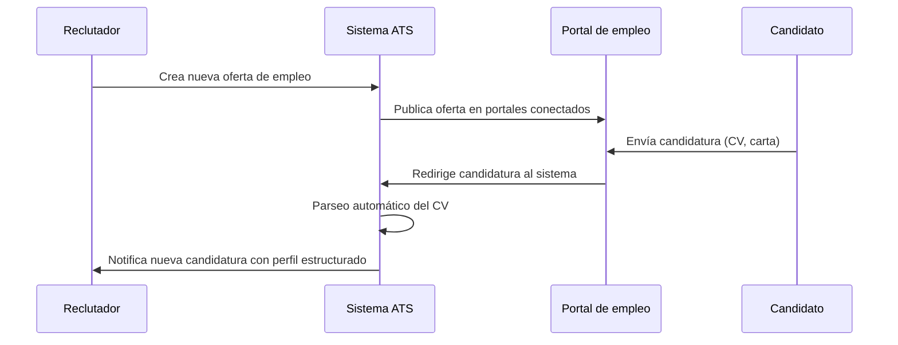
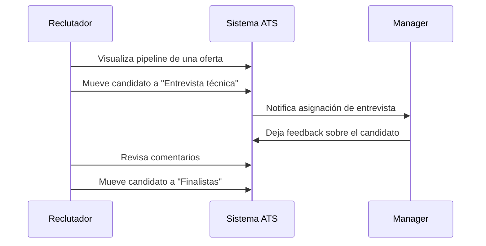
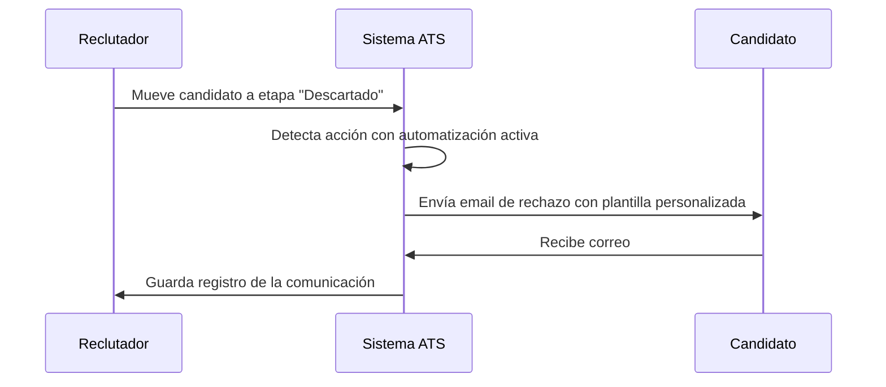
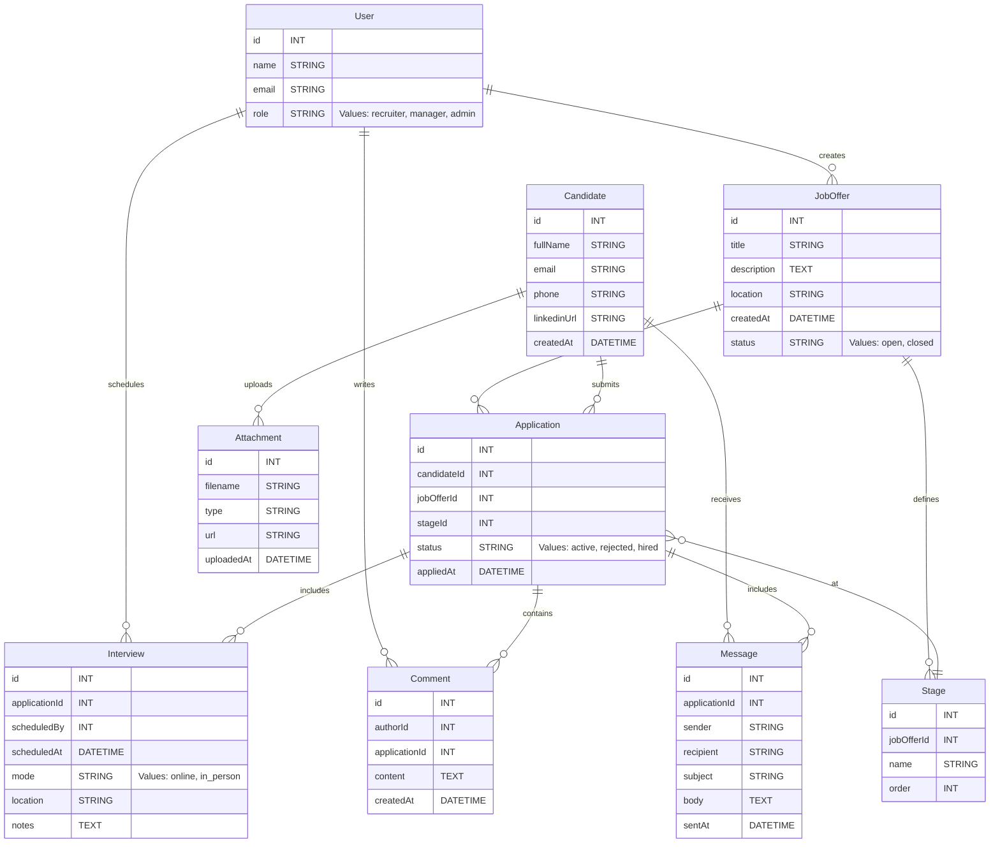
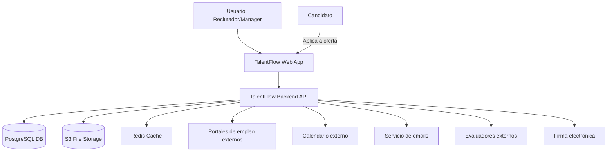

## 🧠 **Nombre del producto: TalentFlow**

### 📄 **Descripción breve del software**

**TalentFlow** es un sistema de seguimiento de candidatos (ATS) moderno y fácil de usar, diseñado para ayudar a equipos de selección a gestionar todo el proceso de reclutamiento desde un único lugar. Su propuesta de valor radica en su **flujo de trabajo visual**, su capacidad de **extraer automáticamente información clave de los CVs**, y su enfoque en la **colaboración entre reclutadores y managers** sin fricciones.

A diferencia de soluciones complejas o anticuadas, TalentFlow ofrece una experiencia intuitiva, altamente automatizada, y adaptable a empresas en crecimiento que necesitan agilidad sin sacrificar control.

---

### ✅ **Funciones principales de TalentFlow (explicación)**

1. ### **🎯 Gestión centralizada de candidatos y ofertas**

   Todas las candidaturas se agrupan por oferta de empleo, con una vista clara de los candidatos, su estado en el proceso y acceso directo a su CV, perfil y comunicaciones previas.

2. ### **📄 Parsing automático de CVs**

   El sistema extrae automáticamente datos clave del currículum (nombre, experiencia, formación, habilidades) y construye un perfil estructurado, reduciendo el trabajo manual y permitiendo búsquedas más potentes.

3. ### **📊 Pipeline visual y etapas personalizables**

   Un panel estilo *kanban* permite visualizar el estado de cada candidato en el proceso de selección. Las etapas son configurables según el flujo de cada empresa (ej: CV recibido → Entrevista técnica → Oferta).

4. ### **🔍 Búsqueda y filtrado inteligente**

   El motor de búsqueda permite localizar candidatos por habilidades, experiencia previa o etapa del proceso, incluso dentro de su CV o carta de presentación, acelerando el cribado.

5. ### **💬 Comunicación integrada con candidatos**

   Envío de correos electrónicos directamente desde la plataforma, con plantillas automáticas y seguimiento de respuestas. Todo el historial queda registrado para máxima trazabilidad.

6. ### **👥 Colaboración en equipo**

   Comentarios internos, asignación de responsables por oferta y gestión de permisos para asegurar que cada miembro del equipo vea solo lo que necesita. Permite una toma de decisiones rápida y compartida.

7. ### **📆 Programación de entrevistas**

   Integración con calendarios (Google/Outlook) para coordinar entrevistas fácilmente. Envío de invitaciones automáticas con enlaces a videollamada si aplica.

8. ### **📈 Reporting básico de procesos**

   Métricas clave como tiempo medio por etapa, conversión por fuente, o candidatos activos por vacante para ayudar a mejorar el proceso de selección continuamente.

## 🧩 Lean Canvas: TalentFlow – ATS ágil y colaborativo para empresas modernas

| **Bloque**                  | **Contenido**                                                                                                                                                                                                                                                                                           |
| --------------------------- | ------------------------------------------------------------------------------------------------------------------------------------------------------------------------------------------------------------------------------------------------------------------------------------------------------- |
| **1. Problema**             | - Reclutadores pierden tiempo con tareas manuales (cribado, emails, programación de entrevistas).<br>- Los ATS existentes son complejos, caros o mal adaptados a empresas medianas.<br>- Falta de colaboración fluida entre RRHH y managers técnicos.                                                   |
| **2. Segmento de Clientes** | - Equipos de RRHH de empresas medianas (20–500 empleados).<br>- Startups en fase de crecimiento.<br>- Consultoras de selección que manejan múltiples procesos.                                                                                                                                          |
| **3. Propuesta de Valor**   | **"ATS ágil, visual y colaborativo que automatiza lo tedioso y potencia el trabajo en equipo"**.<br>- Visual y fácil de usar.<br>- Parsing de CVs automático.<br>- Pipeline personalizable.<br>- Flujo de comunicación centralizado.<br>- Ideal para empresas sin equipos técnicos dedicados a HR Tech. |
| **4. Solución**             | - Kanban de selección intuitivo.<br>- Extracción automática de datos del CV.<br>- Comunicación con candidatos integrada.<br>- Comentarios y roles para equipos.<br>- Integración con calendarios y email.<br>- Reporting básico sin necesidad de analistas.                                             |
| **5. Métricas Clave**       | - Nº de vacantes activas creadas.<br>- Nº de usuarios activos por empresa.<br>- Tasa de conversión en el pipeline.<br>- Tiempo medio hasta contratación.<br>- Retención mensual (churn).                                                                                                                |
| **6. Ventaja Competitiva**  | - Onboarding ultra-rápido: usable en minutos, sin consultoría.<br>- Experiencia UI/UX moderna tipo Trello.<br>- API sencilla para integración futura.<br>- Posibilidad de uso gratuito con límites.                                                                                                     |
| **7. Canales**              | - Marketing de contenido (blog, SEO sobre reclutamiento ágil).<br>- LinkedIn Ads segmentadas a recruiters y HR.<br>- Alianzas con consultoras de RRHH.<br>- Plataformas como Product Hunt o AppSumo.<br>- Demo gratuita auto-gestionada.                                                                |
| **8. Estructura de Costes** | - Desarrollo y mantenimiento (equipo técnico).<br>- Infraestructura cloud (AWS, GCP, etc.).<br>- Soporte y atención al cliente.<br>- Marketing y ventas.<br>- Costes legales (RGPD, contratos).                                                                                                         |
| **9. Fuente de Ingresos**   | - **Modelo SaaS** mensual/anual.<br>  - Plan gratuito: 1 vacante, 1 usuario.<br>  - Plan Pro: 49€/mes (hasta 5 usuarios / 10 vacantes).<br>  - Plan Business: 99€/mes (usuarios ilimitados).<br>  - Add-ons: integraciones, informes avanzados.                                                         |

---

## Casos de uso principales de TalentFlow

## 🟦 **Caso de uso 1: Publicación de oferta y recepción de candidaturas**

### 📌 Descripción:

El reclutador crea una nueva oferta de empleo en el sistema, la publica en distintos portales de empleo (o en su web corporativa), y automáticamente comienza a recibir candidaturas que quedan registradas en el sistema. El sistema parsea los CVs y genera perfiles estructurados para facilitar la evaluación posterior.

### ✅ Objetivo:

Facilitar la difusión de ofertas y automatizar la recopilación y organización de candidaturas.

### 🔁 Diagrama Mermaid:



---

## 🟦 **Caso de uso 2: Gestión del proceso de selección**

### 📌 Descripción:

El reclutador gestiona a los candidatos en un pipeline visual, cambiando su estado conforme avanzan en el proceso. Puede dejar comentarios, programar entrevistas e involucrar a managers u otros miembros del equipo para evaluar conjuntamente a los candidatos.

### ✅ Objetivo:

Tener visibilidad clara del estado de cada candidato y tomar decisiones colaborativas.

### 🔁 Diagrama Mermaid:



---

## 🟦 **Caso de uso 3: Comunicación con candidatos y automatización**

### 📌 Descripción:

El sistema permite enviar correos directamente a los candidatos desde la interfaz del ATS, usando plantillas predefinidas. Además, ciertas acciones pueden estar automatizadas (por ejemplo, envío de mensaje de rechazo al mover a un candidato a la etapa “Descartado”).

### ✅ Objetivo:

Reducir el esfuerzo manual y asegurar una comunicación clara y profesional con cada candidato.

### 🔁 Diagrama Mermaid:



---

# Modelo de base de datos



# Arquitectura del sistema

El sistema se concibe como una aplicación web multiusuario, escalable y moderna, orientada a ofrecer una experiencia rápida y colaborativa.

---

## 🏗️ **Arquitectura de Software: Clean Hexagonal (Ports & Adapters) + Microfrontends**

### ⚙️ **Diseño general**

* **Tipo de arquitectura:**

  * Backend: Clean Architecture / Hexagonal
  * Frontend: Microfrontend modular
  * Infraestructura: Contenedores (Docker) orquestados con Kubernetes
  * Comunicación: REST + Webhooks + Event-driven internal messaging

## 🧩 **Componentes principales**

### 🧠 Dominio / Núcleo (backend)

* **Domain Layer (Core):**

  * Entidades de negocio puras: `Candidate`, `JobOffer`, `Application`, `Stage`, etc.
  * Servicios de dominio y reglas de negocio.
  * Interfaces (puertos) para infraestructura externa: repositorios, servicios de email, integraciones.

* **Application Layer:**

  * Casos de uso orquestados: crear oferta, mover candidato, agendar entrevista, etc.
  * Controladores de eventos internos (command handlers).
  * Gestión de transacciones unitarias (UoW).

* **Adapters Layer (inbound/outbound):**

  * Inbound: REST API (OpenAPI), Webhooks (p.ej. para portales de empleo).
  * Outbound: Email service, calendarios externos (Google, Outlook), portales de publicación.

---

### 🌐 Frontend (SPA modular por microfrontend)

* **Aplicación React (Next.js o Vite) dividida en dominios funcionales:**

  * `Dashboard`: visualización de vacantes y KPIs
  * `Candidaturas`: pipeline visual tipo Kanban
  * `Oferta`: edición/publicación de ofertas
  * `Entrevistas`: agenda e historial
  * `Configuración`: gestión de usuarios, permisos y etapas

* **Comunicación con backend via REST y WebSockets (para tiempo real)**

---

## 🔌 **Integraciones externas**

| Sistema                                           | Método            | Propósito                      |
| ------------------------------------------------- | ----------------- | ------------------------------ |
| **Portales de empleo (LinkedIn, InfoJobs, etc.)** | Webhooks + APIs   | Publicar ofertas y recibir CVs |
| **Servicios de correo (SendGrid / Amazon SES)**   | SMTP / REST API   | Envío de comunicaciones        |
| **Calendarios (Google Calendar / Outlook)**       | OAuth2 + REST API | Programación de entrevistas    |
| **Evaluación técnica (HackerRank, Codility)**     | REST API          | Envío y consulta de pruebas    |
| **Firma digital (DocuSign, Signaturit)**          | REST API          | Firma de ofertas laborales     |

---

## 🗃️ **Persistencia y almacenamiento**

* **PostgreSQL (RDS / Cloud SQL)**

  * Relacional, ACID, ideal para gestión de estados e integridad de procesos.
  * Modelo estructurado basado en el ERD anterior.

* **Redis (caché y sesiones)**

  * Para mejorar el rendimiento de filtros y búsquedas frecuentes.

* **S3-compatible object storage**

  * Para almacenar CVs y archivos adjuntos.

---

## 🛠️ **Patrones y servicios complementarios**

* **CQRS interno (no full event sourcing):**

  * Commands para mutaciones, Queries optimizadas para lectura.

* **Job Queue (BullMQ o Celery):**

  * Procesamiento de tareas asincrónicas: envío de emails, sincronización externa, generación de informes.

* **Event Bus (Kafka / NATS):**

  * Para desacoplar servicios internos y emitir eventos de dominio (`CandidateMovedStage`, `InterviewScheduled`, etc.)

* **Authentication/Authorization:**

  * JWT + Refresh Tokens
  * RBAC con permisos por rol (`admin`, `recruiter`, `manager`)

---

## 🧪 **Testing & observabilidad**

* Tests unitarios en core/domain
* Tests de integración en adapters
* OpenTelemetry para trazas
* Prometheus + Grafana para métricas
* ELK / Loki para logs

---

## 🔐 Seguridad

* Autenticación segura (OAuth2 + 2FA opcional)
* Validación estricta de inputs
* Escaneo de archivos subidos (antivirus/malware)
* Encriptación en tránsito (TLS) y en reposo

---

## Diagrama General del sistema



# Diagrama C4 de la arquitectura del sistema

Este código debe copiar y pegarse en [Structurizr](https://structurizr.com/dsl) para poder visualizarlo como un diagrama C4.

```
workspace {

  model {
    user = person "Reclutador/Manager"

    system = softwareSystem "TalentFlow ATS" {
      user -> this "Utiliza para gestionar procesos de selección"

      webApp = container "Frontend Web (SPA)" {
        technology "React"
      }

      backend = container "Backend API" {
        technology "Node.js / NestJS"
        description "API central que implementa la lógica de negocio"

        webApp -> backend "Consume API REST"

        restController = component "REST Controllers" {
          technology "NestJS Controllers"
        }

        applicationLayer = component "Application Layer" {
          technology "NestJS Services / UseCases"
        }

        domainLayer = component "Domain Layer" {
          technology "Domain Core (Entities, Services, Ports)"
        }

        adapters = component "Infrastructure Adapters" {
          technology "Adapters externos (PostgreSQL, Email, Webhooks)"
        }

        # Relaciones internas
        restController -> applicationLayer
        applicationLayer -> domainLayer
        applicationLayer -> adapters

        # Nivel 4: Código del dominio
        candidate = component "Candidate (Entidad)" {
          technology "Entity"
        }

        jobOffer = component "JobOffer (Entidad)" {
          technology "Entity"
        }

        application = component "Application (Entidad)" {
          technology "Aggregate Root"
        }

        stage = component "Stage (Value Object)" {
          technology "Value Object"
        }

        appService = component "ApplicationService" {
          technology "Domain Service"
        }

        stagePolicy = component "StagePolicy" {
          technology "Domain Rule"
        }

        candidateRepo = component "CandidateRepository (Interface)" {
          technology "Port"
        }

        jobOfferRepo = component "JobOfferRepository (Interface)" {
          technology "Port"
        }

        domainLayer -> candidate
        domainLayer -> jobOffer
        domainLayer -> application
        domainLayer -> stage
        domainLayer -> appService
        domainLayer -> stagePolicy
        domainLayer -> candidateRepo
        domainLayer -> jobOfferRepo

        application -> stage
        appService -> application
        appService -> stagePolicy
        appService -> candidateRepo
        appService -> jobOfferRepo
      }

      eventBus = container "Event Bus" {
        technology "Kafka"
        backend -> eventBus
      }

      queue = container "Job Queue" {
        technology "BullMQ + Redis"
        backend -> queue
      }
    }
  }

  views {

    systemContext system {
      include *
      autolayout lr
      title "TalentFlow - System Context"
    }

    container system {
      include *
      autolayout lr
      title "TalentFlow - Containers"
    }

    component backend {
      include restController
      include applicationLayer
      include domainLayer
      include adapters
      autolayout lr
      title "TalentFlow - Componentes del Backend"
    }

    component backend {
      include candidate
      include jobOffer
      include application
      include stage
      include appService
      include stagePolicy
      include candidateRepo
      include jobOfferRepo
      autolayout lr
      title "TalentFlow - Nivel 4: Código del dominio"
    }

    theme default
  }
}
```